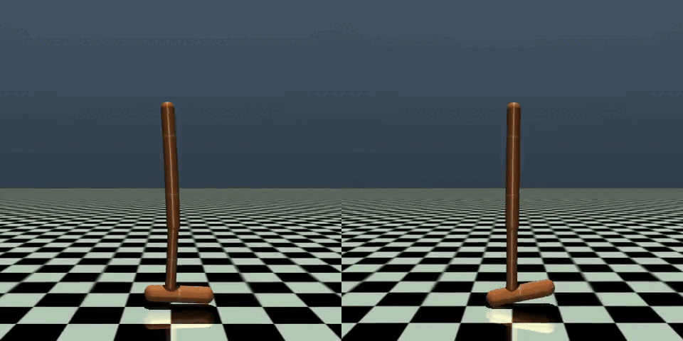

# PPO_in_10min

## PPO code - All you need to know (80/20 rule applied)

### Bioengineering applications at stake !

Corresponding [Medium article](https://medium.com/@juliengado.2001/ppo-theory-code-in-10-minutes-all-you-need-to-know-80-20-rule-applied-e5d1878815e7)

[Acknowledgement: the code is inspired from [this code](https://github.com/labmlai/annotated_deep_learning_paper_implementations/tree/master/labml_nn/rl/ppo)]

My goal: Provide you with the keys to fully understand, explain, and implement a state-of-the-art RL method: Proximal Policy Optimization (PPO);

My tools: Python, PyTorch and Mathematical Theory;

Your takeaway: Enhanced understanding of RL techniques and recognised skills in AI, applied to PPO;

Bonus: A bioengineering application;

### Some results

PPO on Hopper-v5

Movement disorders and solution with PPO on Hopper-v5

### Key Files

- **`src/`**: Contains all the application code.
- **`checkpoint/`**: For storing the pretrained models' weights.
- **`results/`**: For storing the figures and videos.

- **`ppo.ipynb`**: Run the PPO algoritmh in a step-by-step customization.
- **`ppo_noised.ipynb`**: Run the PPO algoritmh in a step-by-step customization.
- **`ppo_25runs.ipynb`**: Run the PPO algoritmh 25 times to average the plots.
